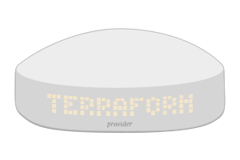

<div align="center">

<h1><code>terraform-provider-freebox</code></h1>
</div>

🔌 A `terraform` provider to interact with the [Freebox modem](https://en.wikipedia.org/wiki/Freebox) from the [French internet service provider Free](https://en.wikipedia.org/wiki/Free_(ISP)).

## Requirements

- Install `go >= 1.21` by following the [official documentation](https://go.dev/doc/install)
- Install `terraform` with the [online instructions](https://developer.hashicorp.com/terraform/downloads)
- Install `mdbook` as [described on the tool's website](https://rust-lang.github.io/mdBook/guide/installation.html)

## Documentation

Run the following to generate the contents of `docs/` folder:

```shell
go run github.com/hashicorp/terraform-plugin-docs/cmd/tfplugindocs
```

Then serve the book using:

```shell
mdbook serve book/
```

And visit http://127.0.0.1:3000 in your favorite browser.

## Tests

```shell
go run github.com/onsi/ginkgo/v2/ginkgo ./...
```

## Coverage

The coverage profile can be generated by running:

```shell
go run github.com/onsi/ginkgo/v2/ginkgo -p -v --coverprofile=coverage.txt ./...
```

And inspected in your browser by running:

```shell
go tool cover -html=coverage.txt
```
